#ARRIBA-Breast-Cancer-Fusion-Analysis

# ARRIBA-Based Gene Fusion Analysis in ER+/HER2− Breast Cancer

A reproducible RNA-seq workflow for **ARRIBA-based gene fusion detection, visualization, downstream analysis, and independent validation**.

**Discovery cohort:** GSE103001  
**Validation cohort:** GSE58135  
**Reference:** GRCh38 + GENCODE release 38  
**Fusion caller:** ARRIBA v2.5.1

---

## Overall Workflow

```mermaid
flowchart TD

    A[GSE103001<br/>Discovery Cohort]

    A --> B[SRA Download]
    B --> C[SRA → Paired-end FASTQ]
    C --> D[FASTQ Compression]
    D --> E[FastQC]
    E --> F[Trimmomatic]
    F --> G[Post-trimming FastQC]

    G --> H[ARRIBA Fusion Calling<br/>GRCh38 + GENCODE38]
    H --> I[draw_fusions.R Visualization]

    I --> J[Master Fusion Table]
    J --> K[Single-gene Frequency]
    K --> L[Fusion-pair Frequency]
    L --> M[Sample-level Recurrence]
    M --> N[Multi-gene Annotation Handling]
    N --> O[Annotated Fusion-pair Summary]
    O --> P[Candidate Ranking]
    P --> Q[Intergene Fusion Filtering]

    Q --> R[Differential Gene-expression Analysis]
    R --> S[ssGSEA Pathway Analysis]

    S --> T[Discovery Fusion Candidates]

    T --> U[GSE58135<br/>Independent Validation Cohort]

    U --> V[SRA Download]
    V --> W[SRA → Paired-end FASTQ]
    W --> X[FASTQ Compression]
    X --> Y[FastQC]

    Y --> Z[ARRIBA Fusion Calling<br/>GRCh38 + GENCODE38]
    Z --> AA[draw_fusions.R Visualization]

    AA --> AB[Downstream Fusion Processing]
    AB --> AC[Cross-cohort Fusion Comparison]
    AC --> AD[Direct Breakpoint Comparison<br/>GRCh38]
    AD --> AE[Final Validation Summary]
```



---

## PART 1: RNA-seq Preprocessing and Fusion Detection

Raw sequencing data were retrieved from NCBI SRA and converted to paired-end FASTQ files using **SRA Toolkit**. FASTQ files were compressed using **pigz**, and sequencing quality was evaluated using **FastQC**.

For **GSE103001**, reads were processed using **Trimmomatic** followed by post-trimming quality assessment.

For **GSE58135**, trimming was not retained in the final workflow, and the original quality-controlled paired-end reads were used for fusion detection.

Gene fusion calling was performed using **ARRIBA v2.5.1** together with **STAR v2.7.11b**, using the **GRCh38 reference genome** and **GENCODE release 38** annotation.

ARRIBA was executed independently for each RNA-seq sample using the official `run_arriba.sh` workflow.

Principal outputs included:

```text
fusions.tsv
fusions.discarded.tsv
Aligned.sortedByCoord.out.bam
Aligned.sortedByCoord.out.bam.bai
run_arriba.log
```

Fusion events were subsequently visualized using **draw_fusions.R**, including fusion structure, Circos representation, protein-domain organization, and read-support information.

---

## PART 2: Downstream Fusion Analysis

Sample-level `fusions.tsv` files were consolidated into cohort-specific master fusion tables.

The downstream analysis included:

1. **Single-gene frequency** — frequency of individual genes involved in fusion events.
2. **Fusion-pair frequency** — occurrence frequency of each `gene1–gene2` pair.
3. **Sample-level recurrence** — event count and independent sample recurrence.
4. **Multi-gene annotation analysis** — separation of records containing multiple gene annotations.
5. **Annotated fusion-pair summary** — integration of recurrence, confidence, read support, breakpoint information, and fusion annotations.
6. **Candidate ranking** — prioritization based on recurrence and supporting evidence.
7. **Intergene fusion filtering** — selection of fusion candidates involving different gene partners.

---

## PART 3: Expression and Pathway Analysis

Differential gene-expression analysis was performed for **GSE103001** using **GEO2R**, comparing 22 primary tumor samples with 22 adjacent normal samples.

Selected target genes included:

`TIMM17B`, `ERAS`, `TIMM23`, `TIMM50`, `TOMM20`, `ATF5`, `PIK3CA`, `AKT1`, `MTOR`, and `RPS6KB1`.

For pathway analysis, a TPM expression matrix was prepared and Entrez Gene identifiers were mapped to gene symbols.

Expression values were transformed as:

```text
log2(TPM + 1)
```

Single-sample Gene Set Enrichment Analysis (**ssGSEA**) was performed using `gseapy` for custom gene sets related to PI3K–AKT signaling, mTOR signaling, oxidative phosphorylation, mitochondrial protein import, apoptosis, ROS pathway, and mitochondrial organization.

Tumor and normal pathway scores were compared using a two-sided **Mann–Whitney U test** followed by **Benjamini–Hochberg FDR correction**.

---

## PART 4: Independent Validation

The downstream fusion analysis workflow was independently applied to **GSE58135**.

Fusion candidates identified in GSE103001 were compared with GSE58135 to evaluate reproducibility at two levels:

1. **Gene-pair reproducibility**
2. **Genomic breakpoint concordance**

Because both datasets were processed using **GRCh38/GENCODE38**, breakpoint coordinates were compared directly without genome-build conversion or LiftOver.

---

## Software

| Software | Version |
|---|---:|
| ARRIBA | 2.5.1 |
| STAR | 2.7.11b |
| samtools | 1.23.1 |
| SRA Toolkit | 3.4.1 |
| FastQC | 0.12.1 |
| Trimmomatic | 0.41 |
| pigz | 2.8 |

Downstream analyses were performed using Python, including `pandas`, `mygene`, `gseapy`, and `statsmodels`.

---

## Data Availability

Public RNA-seq datasets used in this study:

- **GSE103001** — discovery cohort
- **GSE58135** — independent validation cohort

Raw sequencing data and large alignment files are not included in this repository and can be obtained from NCBI GEO/SRA.

---

## Code Availability

All custom scripts used for preprocessing, ARRIBA execution, fusion visualization, downstream analysis, expression/pathway analysis, and independent validation are provided in this repository.

